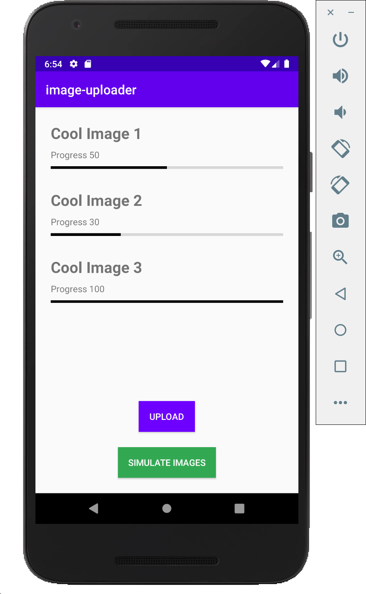
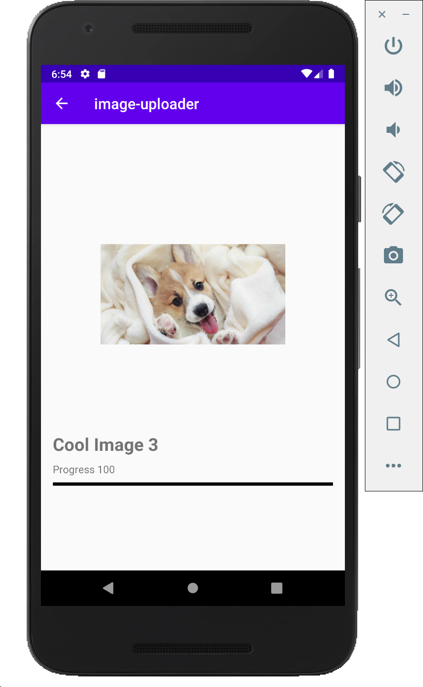

# Image Uploader

 
  

## Getting Started

1. Clone Repository from Github
2. Run the app
3. Hit Simulate Images to mock uploaded images

## App Architecture

This app uses a MVVM+Repo design pattern with data binding and a single activity with multiple fragments. The biggest challenge in the designs is handling the results of an uploaded image. Both the Home Screen (ImageListFragment) and the Details Screen (ImageDetailsFragment) require the results from the networking call. To tackle this problem, I moved the networking calls into a Repository file similar to what I mentioned in our discussion. The repository asyncronously uploads each image and on return, updates a Live Data field observed by both fragments' view models. This gives both fragments access to the returned image/progress. 

Each view model's properties are Live Data bound directly to an XML. (note: I didn't want to complicate the adapter by adding view binding so adapter sets up its own view instead) Using live data also handles the async network return through LiveData.postValue().

I tried hard to build something that would demonstrate the architecture pattern I had in mind without going overboard on the app itself. I did my best to add comments where I made certain shortcuts to note that it isn't the approach I would normally take. 